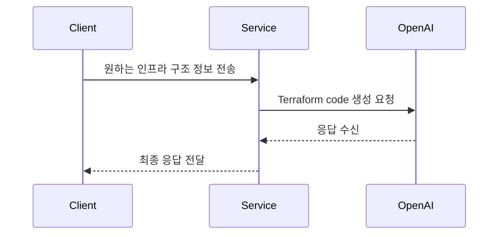

# Infrastructure Service

## 🌐 프로젝트 개요

이 서비스는 OpenAI API를 활용하여 인프라 구조 정보를 처리하는 것이 주 목적입니다. 사용자로부터 인프라 구조 정보를 받아 이를 처리하고, 그 결과를 반환합니다.

## 🛠️ 프로젝트 개발 환경

### OS 환경

> macOS Sonoma

### 개발 도구

> IDE: Intellij IDEA  
> Java 17

### 빌드 도구

> Gradle

### 주요 플러그인 버전

> 'org.springframework.boot': '3.2.2'  
> 'io.spring.dependency-management': '1.1.4'  
> 'org.springdoc:springdoc-openapi-starter-webmvc-ui': '2.1.0'

## 🔀 프로젝트 아키텍처



## 📑 API 명세

본 서비스는 다음과 같은 API를 제공합니다:

1. 인프라 구조 코드 생성: 사용자로부터 받은 인프라 구조 요청을 테라폼 코드로 변환하여 새로운 인프라 구조 코드를 시스템에 생성합니다.

## 🚀 프로젝트 생성 방법

이 서비스를 사용하기 위해서는 먼저 OpenAI API 키가 필요합니다.

프로젝트 생성에 앞서 OpenAI API 키를 받아주세요.

1. 프로젝트 다운로드: Git을 사용하여 이 프로젝트를 로컬 시스템으로 복제합니다.

```shell
git clone https://github.com/gcu-terraform/infra.git
```

2. OpenAI API 키 설정: 복제한 프로젝트의 application.yml 파일에 OpenAI API 키를 설정합니다.

```yaml
openai:
  api:
    key: YOUR_OPENAI_API_KEY
```

3. 프로젝트 실행: 프로젝트의 루트 디렉토리에서 다음의 명령어를 실행하여 프로젝트를 구동합니다.

```shell
./gradlew bootRun
```

이제 로컬 시스템에서 이 서비스를 사용할 수 있습니다. 

웹 브라우저를 열어 http://localhost:8080/swagger-ui.html 주소를 방문하면 Swagger UI를 통해 API를 확인하고 테스트할 수
있습니다.